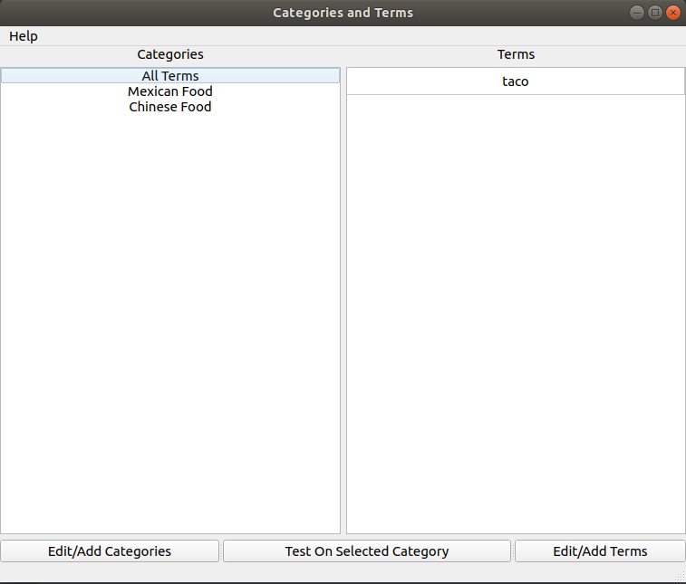

   

# Studier

> A user enters categories, puts terms in those categories, than will be quizzed on them in a flashcard format. 

* Versions 
    * 1.0.0
* Dependences 
    * PyQt5

## Installation

* Option 1 
    * Clone, download, or pull this repo. 
    * If downloaded/cloned, export the zip file.
    * Go into the directory the project is in
    * Open the terminal 
    * Create a virtual environment with `python -m venv venv_name`(optional)
    * After the environment is created activate it with ./venv_name/Scripts/Activate.ps1
    * Run `pip install -r requirements.txt`
    * Run `python Main.py`
    * If virtual environment was created, deactivate it with `deactivate` when finished
* Option 2 
    * Run the .exe file found under the releases tab on Github
    * Pick a folder to install the application into 
    * After the install has finished, find the .exe file in the Studier folder and open it

### Clone

- Clone this repo to your local machine using `git clone https://github.com/wcrandall/Studier.git`

## Contributors
* <a href="https://github.com/wcrandall"> Wyatt Crandall </a>
